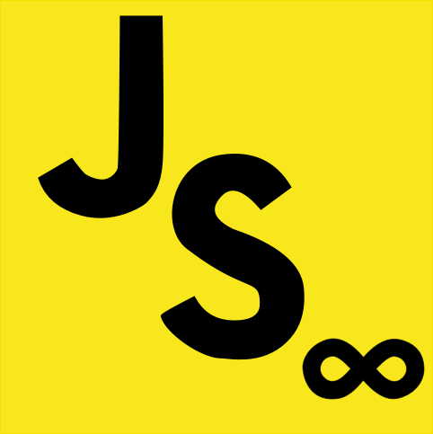

# generator-es-infinity [![NPM version][npm-image]][npm-url] [![Build Status][travis-image]][travis-url] [![Dependency Status][daviddm-image]][daviddm-url]



> Bootstrap common libraries needed to write in es6 and beyond

## Installation

First, install [Yeoman](http://yeoman.io) and generator-es-infinity using [npm](https://www.npmjs.com/) (we assume you have pre-installed [node.js](https://nodejs.org/)).

```bash
npm install -g yo
npm install -g generator-es-infinity
```

even better

```bash
yarn global add yo
yarn global add generator-es-infinity
```

Then generate your new project:

```bash
yo es-infinity
```

## Getting To Know Yeoman

* Yeoman has a heart of gold.
* Yeoman is a person with feelings and opinions, but is very easy to work with.
* Yeoman can be too opinionated at times but is easily convinced not to be.
* Feel free to [learn more about Yeoman](http://yeoman.io/).

## TODO

* Prompt to make repo
* Add in webpack / react options
* Custom entries
* Babel options, transpilation step
* More customization (jest, babel packages...)
* Better initialization of git repo
* Use nsp
* Make logo

## License

MIT © [Jordan Tepper]()

[npm-image]: https://badge.fury.io/js/generator-es-infinity.svg
[npm-url]: https://npmjs.org/package/generator-es-infinity
[travis-image]: https://travis-ci.org/HeroProtagonist/generator-es-es-infinity.svg?branch=master
[travis-url]: https://travis-ci.org/HeroProtagonist/generator-es-infinity
[daviddm-image]: https://david-dm.org/HeroProtagonist/generator-es-infinity.svg?theme=shields.io
[daviddm-url]: https://david-dm.org/HeroProtagonist/generator-es-infinity
